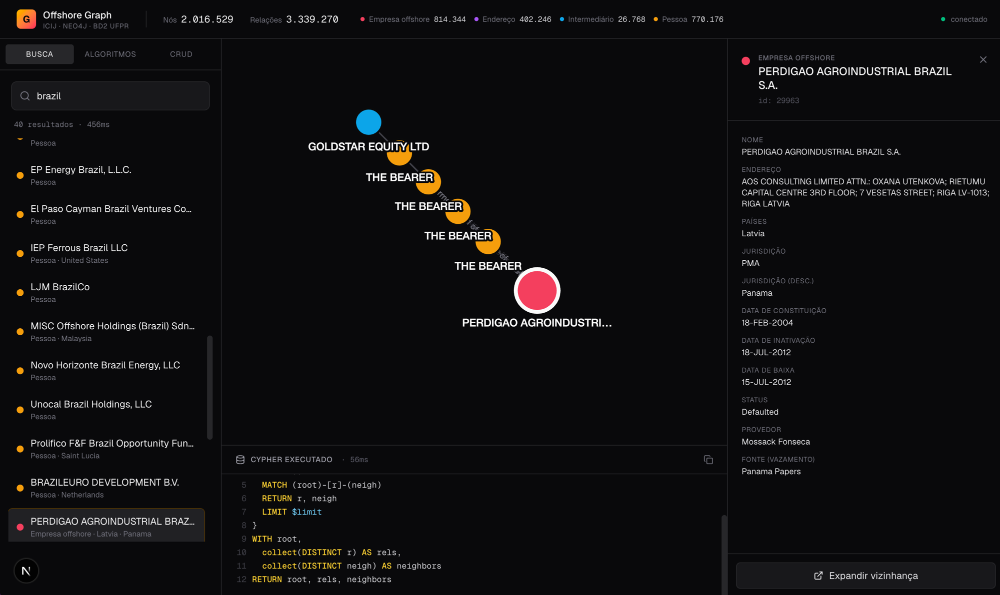
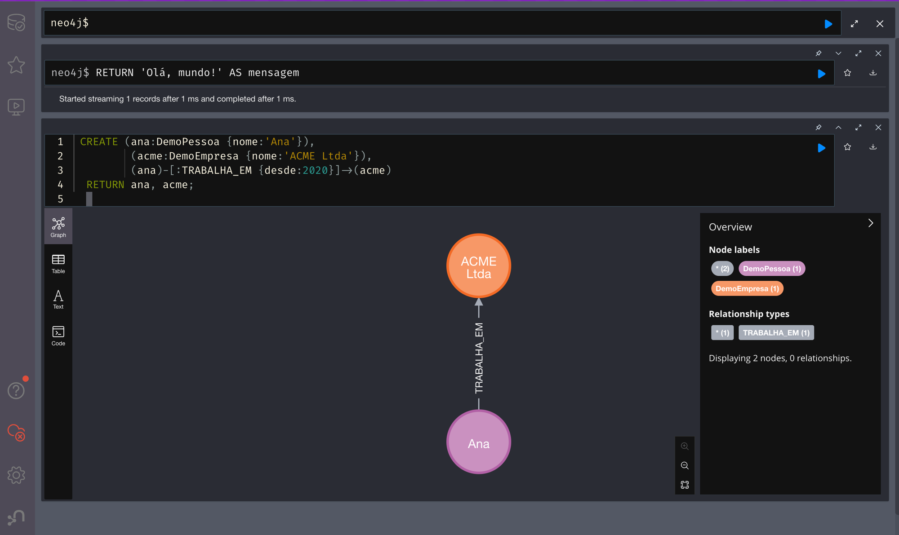

# Banco de Dados 2: Trabalho Final

**Tema 9: Graph Databases (Neo4j).** UFPR, 17/06/2026.

Demo investigativa sobre o dataset real do [ICIJ Offshore Leaks](https://offshoreleaks.icij.org/)
(Panama Papers, Paradise Papers, Pandora Papers, Bahamas Leaks e Offshore Leaks combinados:
cerca de 2 milhões de nós e 3,3 milhões de relações), com comparação lado a lado de Cypher vs SQL,
incluindo um benchmark que roda as mesmas perguntas nos dois bancos e mede.

**Slides da apresentação (ao vivo):** https://ocoiel.github.io/ufpr-bd2-graph-databases/
Navegue com as setas. A tecla `N` abre o roteiro de cada slide e `F` ativa a tela cheia.

## Visão geral

**O app investigativo, no estilo "siga o dinheiro".** Busca uma pessoa ou empresa, abre a vizinhança
no grafo e investiga a partir dali. Cada ação revela o Cypher exato executado, com o tempo:



**"Olá, mundo" em Cypher** (Neo4j Browser). A sintaxe é "ASCII-art": `()` é um nó e `-[]->` é um
relacionamento, então o código se parece com o desenho:



## Stack

- **Neo4j 5.26 Community** (plugins GDS + APOC): banco de grafos
- **PostgreSQL 17**: banco relacional, espelho do grafo, usado na comparação
- **Docker Compose**: orquestração local dos dois bancos
- **Next.js 16, React 19 e Cytoscape.js**: front investigativo de visualização

## Como baixar e rodar

### Pré-requisitos

- Docker e Docker Compose (Docker Desktop no Mac ou Windows)
- Node.js 20 ou superior (o npm já vem junto)
- Cerca de 5 GB livres (dump do ICIJ mais os volumes dos bancos)

### Passo a passo

```bash
# 1. Clonar e configurar
git clone https://github.com/ocoiel/ufpr-bd2-graph-databases.git
cd ufpr-bd2-graph-databases
cp .env.example .env

# 2. Subir Neo4j e Postgres
docker compose up -d
#    (no primeiro boot o Neo4j baixa os plugins GDS/APOC; aguarde cerca de 1 min ficar "healthy")

# 3. Baixar o dump do ICIJ (cerca de 1,5 GB) para a pasta data/
curl -L -o data/icij-offshoreleaks-5.13.0.dump \
  https://offshoreleaks-data.icij.org/offshoreleaks/neo4j/icij-offshoreleaks-5.13.0.dump

# 4. Carregar o dump no Neo4j (rodar uma vez; leva alguns minutos)
./scripts/load-neo4j-dump.sh

# 5. Instalar dependências e espelhar o grafo no Postgres (rodar uma vez; cerca de 4 min)
cd app
npm install
npm run mirror:pg -- --truncate

# 6. Subir o app
npm run dev
```

### Acessos

| Serviço | URL | Credenciais |
|---|---|---|
| App | http://localhost:3000 | (sem login) |
| Neo4j Browser | http://localhost:7474 | `neo4j` / `panama-papers-2026` |
| Postgres | `psql -h localhost -U postgres offshoreleaks` | senha: `panama-papers-2026` |

Se a porta 5432 já estiver ocupada por um Postgres local, edite `POSTGRES_PORT` no `.env`
(por exemplo `5433`) antes do `docker compose up`.

## O app

Front investigativo no estilo "siga o dinheiro". Cada interação revela o Cypher por trás, e isso é
parte da demonstração.

- **Busca**: encontra Officers (pessoas), Entities (empresas) e Intermediaries por nome
- **Grafo**: vizinhança interativa (Cytoscape com layout fcose); clique num nó para expandir
- **Algoritmos (GDS)**: PageRank (mais influentes), Louvain (comunidades) e caminho mais curto
  entre dois nós, projetados sob demanda na vizinhança
- **CRUD**: cria, edita e remove nós e relações
- **Painel de Cypher**: mostra a query exata executada a cada ação, com o tempo

## SQL vs Cypher: o coração do trabalho

O mesmo grafo vive nos dois bancos. O ETL `npm run mirror:pg` copia o Neo4j para o schema relacional
de `postgres/init/01_schema.sql`. Assim dá para fazer a mesma pergunta nos dois paradigmas e medir,
sobre exatamente o mesmo dado.

- **Queries comentadas**: `postgres/queries/sql_vs_cypher.sql`, cada SQL com o Cypher equivalente ao lado.
- **Catálogo executável**: `app/scripts/lib/query-pairs.mjs`, os pares como dados.
- **Benchmark**: `npm run bench` roda os pares nos dois bancos (com aquecimento e repetições) e imprime
  uma tabela comparativa em Markdown.

```bash
cd app
npm run bench -- --runs 5 --hops 6                 # tabela comparativa
node --env-file=../.env scripts/hop-sweep.mjs      # degradação do SQL por profundidade (2 a 6 hops)
```

### Resultado medido (neste dataset)

| Pergunta | Hops | Cypher | SQL | Vencedor |
|---|---|---|---|---|
| Buscar por nome | 0 | 80,9 ms | 70,0 ms | empate |
| Empresas controladas | 1 | 2,8 ms | 25,9 ms | Cypher 9x |
| Mesmo intermediário | 2 | 2,9 ms | 567,6 ms | Cypher 193x |
| Caminho mais curto | variável | 5,7 ms | timeout (acima de 20 s) | Cypher |
| PageRank (influência) | grafo | 367,9 ms | não existe | Cypher |

**A tese:** a tradução de SQL para Cypher é trivial (cada "seta" vira um JOIN), mas o desempenho só
empata nos casos rasos. A vantagem do grafo cresce de forma desproporcional com os hops: 2 hops já
viram 4 JOINs, e caminho de profundidade variável vira um CTE recursivo que estoura o
`statement_timeout`. PageRank e Louvain (GDS) nem têm equivalente declarativo em SQL puro.

## Dataset

Baixado de: https://offshoreleaks-data.icij.org/offshoreleaks/neo4j/icij-offshoreleaks-5.13.0.dump

- Tipos de nó: Officer (pessoa), Entity (empresa offshore), Intermediary (escritório) e Address
- Cerca de 2,0 milhões de nós e 3,3 milhões de relações
- Licença: Open Database License (ODbL). Sempre cite o ICIJ ao usar.

## Estrutura

```
.
├── docker-compose.yml          # Neo4j + Postgres
├── data/                       # dump do ICIJ (gitignored; baixar no passo 3)
├── docs/img/                   # screenshots do README
├── slides/                     # apresentacao (deck HTML), roteiro e guia de estudo (PDF)
├── postgres/
│   ├── init/                   # schema relacional (rodado na inicializacao)
│   └── queries/                # queries comentadas SQL vs Cypher
├── scripts/
│   └── load-neo4j-dump.sh      # carrega o dump no Neo4j
└── app/                        # front Next.js + scripts de comparacao
    ├── app/                    # rotas e API (busca, vizinhanca, path, GDS, CRUD)
    ├── components/             # paineis e visualizacao do grafo
    ├── lib/                    # driver Neo4j, queries Cypher, tipos
    └── scripts/
        ├── mirror-to-postgres.mjs   # ETL Neo4j para Postgres
        ├── benchmark.mjs            # benchmark SQL vs Cypher
        ├── hop-sweep.mjs            # benchmark de profundidade (caminho mais curto)
        └── lib/query-pairs.mjs      # catalogo de pares de query
```

## Apresentação

- Slides (ao vivo): https://ocoiel.github.io/ufpr-bd2-graph-databases/
- Fontes: `slides/index.html` (deck), `slides/ROTEIRO.md` (roteiro falado) e
  `slides/Graph-Databases-ESTUDO.pdf` (guia de estudo)
